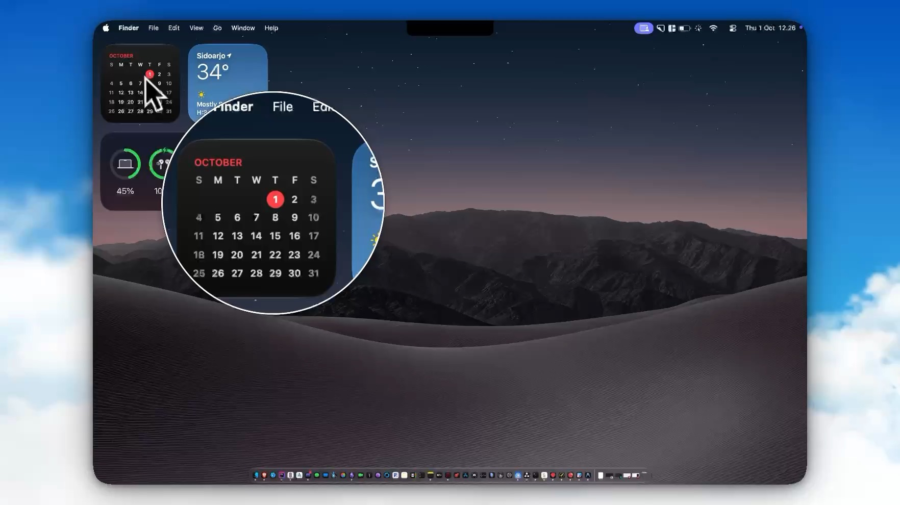

# Presentools

Minimal presentation utilities for macOS: Spotlight, Laser Pointer, and Zoom Lens. Global hotkeys, toggle-based activation, a small no-dependency native app.

[](website/asset/site-demo.mp4)

## Requirements

- macOS 27.0+
- Screen Recording permission, needed only for Zoom Lens

## Installation

### Homebrew

```bash
brew tap ardith666/presentools
brew install --cask presentools
```

Presentools is ad-hoc signed — there is no paid Developer ID behind it. The first time macOS launches a freshly downloaded unsigned app, Gatekeeper blocks it. Right-click (or Control-click) Presentools in Applications and choose **Open** once. After that it launches normally.

### DMG

Download the latest `.dmg` from [Releases](https://github.com/ardith666/presentools/releases), open it, and drag `Presentools.app` to `/Applications`. If Gatekeeper blocks the first launch, right-click **Open** once.

## Shortcuts

| Key | Effect |
|-----|--------|
| `⌥0` | All off |
| `⌥1` | Spotlight |
| `⌥2` | Laser Pointer |
| `⌥3` | Zoom Lens |
| `⌥Esc` | All off (panic — clears whatever is active) |

All four effects activate in **toggle** mode: press once to turn on, press again to turn off. `⌥Esc` always turns everything off.

Open **Shortcuts…** from the menu bar to rebind any key or change an activation mode to hold or auto-repeat.

## Effects

- **Spotlight** — dims the surround so attention goes to one part of the slide
- **Laser Pointer** — a small, high-contrast dot for calling out detail
- **Zoom Lens** — magnifies the region under the cursor

Zoom Lens needs Screen Recording permission because it reads the screen. Presentools asks on first use; Spotlight and Laser Pointer work without it.

## Updates

Presentools checks for a new release at launch. Turn that off with **Check for Updates Automatically** in the menu bar, or run **Check for Updates…** whenever you like.

An update downloads the `.dmg`, checks its SHA-256 against the digest published in the release notes, and opens the folder. The running app is never replaced — drag the new app over the old one yourself. That is deliberate: replacing a signed bundle in place can reset the Screen Recording grant, and Zoom Lens would stop working without any obvious reason.

## Launch at Login

The first time you launch Presentools it asks whether to start at login. Turn it on or off at any time from the menu bar under **Launch at Login**. The tick reflects the real system state, so if you disable the item in System Settings the tick clears on the next launch. If macOS needs your approval, the tick shows as mixed — approve it in System Settings.

## Development

```bash
swift build -c release
./bundle.sh release
.build/release/presentools --selftest
```

`--selftest` renders every effect and asserts on the pixels, drives the hotkey decision matrix without Carbon, and covers version comparison and update digest parsing. It needs no network and no login item.

## License

MIT